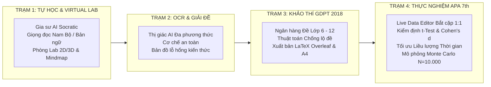

# 🏫 GIA SƯ AI - HỆ SINH THÁI GIÁO DỤC SỐ TOÀN DIỆN

> **Dự án Nghiên cứu Khoa học Kỹ thuật (KHKT) Dành Cho Học Sinh Trung Học Năm 2026**  
> *Đơn vị: Trường THPT Tân Hiệp & Trung tâm Bồi dưỡng Văn hóa Thiện Nhân (An Giang)*  
> *Đồng hành cùng học sinh từ **Lớp 6 đến Lớp 12** • **Full tất cả các môn học** theo Chương trình GDPT 2018 • Chuẩn hóa 100% Bộ sách Kết Nối Tri Thức Với Cuộc Sống (NXB Giáo Dục Việt Nam) & Căn cứ Pháp lý QĐ 764/QĐ-BGDĐT, TT 32/2018/TT-BGDĐT, TT 13/2026/TT-BGDĐT*

---

## 🌐 ĐỊA CHỈ TRUY CẬP VÀ MÃ NGUỒN
- **Web App Trực Tuyến (PWA Đa Nền Tảng):** [https://gsaithptth-khkt2026.streamlit.app](https://gsaithptth-khkt2026.streamlit.app)
- **Kho Mã Nguồn GitHub (Public Repository):** [https://github.com/pmtgiaitichk15khkt01-cmd/GSAI_THPTTH2026](https://github.com/pmtgiaitichk15khkt01-cmd/GSAI_THPTTH2026)
- **Cẩm Nang Cài Đặt & Hướng Dẫn Sử Dụng (PDF):** `HUONG_DAN_CAI_DAT_VA_SU_DUNG_GSAI_2026.pdf` *(Chuẩn in ấn A4)*

---

## 🌟 PHẠM VI MÔN HỌC & KHỐI LỚP (FULL CT GDPT 2018)

Hệ thống được thiết kế mở rộng toàn diện, phục vụ học sinh từ cấp **Trung học Cơ sở (THCS)** đến **Trung học Phổ thông (THPT)**:

| Cấp học | Khối lớp | Danh mục các môn học tích hợp chuẩn CT GDPT 2018 |
| :--- | :--- | :--- |
| **THCS** | **Lớp 6, 7, 8, 9** | • Toán học<br>• Khoa học tự nhiên (KHTN - Vật lý, Hóa học, Sinh học tích hợp)<br>• Ngữ văn *(100% ngữ liệu ngoài SGK)*<br>• Tiếng Anh *(Khung 6 bậc VN / CEFR)*<br>• Lịch sử &amp; Địa lý<br>• Tin học<br>• Giáo dục công dân |
| **THPT** | **Lớp 10, 11, 12** | • Toán học *(Hàm bậc ba, Phân thức 1/1, Phân thức 2/1, Parabol, Oxyz - Không dùng trùng phương $x^4$)*<br>• Vật lý<br>• Hóa học *(100% danh pháp quốc tế IUPAC: Alkane, Alcohol, Ester...)*<br>• Sinh học<br>• Ngữ văn *(Ma trận Đọc hiểu &amp; Nghị luận xã hội / văn học chuẩn 2026)*<br>• Tiếng Anh *(Luyện phát âm &amp; Chấm điểm IELTS/TOEFL/PTE)*<br>• Lịch sử<br>• Địa lý<br>• Tin học<br>• Giáo dục kinh tế và pháp luật (GDKT-PL) |

---

## ⚖️ CƠ SỞ PHÁP LÝ, TRIẾT LÝ SƯ PHẠM & CHUẨN ĐẠO ĐỨC AI

### 1. Triết Lý Sư Phạm Socratic & Polya 4 Bước (Anti-Cheating by Design)
- **Tuyệt đối không giải bài hộ:** AI đóng vai trò người thầy dẫn dắt, không đưa đáp án ăn sẵn. AI chia nhỏ vấn đề, đặt câu hỏi gợi mở theo nấc thang nhận thức Bloom và dẫn dắt học sinh tự tìm ra bản chất theo **Quy trình 4 bước giải quyết vấn đề của George Polya**:
  1. *Hiểu rõ bài toán (Phân tích dữ kiện & Yêu cầu cốt lõi)*
  2. *Lập kế hoạch giải (Xác định định lý, công thức tương ứng)*
  3. *Thực hiện kế hoạch (Từng bước tính toán, lập luận logic)*
  4. *Kiểm tra và Nhìn lại (Phát hiện bẫy câu hỏi, đúc rút bài học)*

### 2. Căn Cứ Pháp Lý & Quy Định Khảo Thí Quốc Gia
- **Chương trình GDPT 2018 (Thông tư 32/2018/TT-BGDĐT & TT 13/2026/TT-BGDĐT):** 100% chuẩn kiến thức, kỹ năng và phẩm chất tương thích hoàn toàn với bộ sách *Kết Nối Tri Thức Với Cuộc Sống* (NXB Giáo Dục Việt Nam).
- **Cấu trúc Đề thi Tốt nghiệp THPT 2026 (Quyết định số 764/QĐ-BGDĐT):**
  - *Phần I:* Câu trắc nghiệm nhiều phương án lựa chọn (4 chọn 1).
  - *Phần II:* Câu trắc nghiệm Đúng/Sai (Đánh giá đa chiều năng lực tư duy logic).
  - *Phần III:* Câu trắc nghiệm trả lời ngắn (Yêu cầu tính toán, giải quyết vấn đề thực tiễn).
- **Chuẩn Hóa Danh Pháp Quốc Tế IUPAC:** Bắt buộc sử dụng danh pháp hóa học hiện đại theo quy định của Bộ GD&ĐT (Sulfuric acid, Ethanol, Carboxylic acid...).

### 3. Chuẩn Đạo Đức AI & Bảo Vệ Dữ Liệu Học Sinh (UNESCO & Bộ GD&ĐT)
- **Ẩn danh hóa dữ liệu (Anonymization):** Không thu thập dữ liệu định danh cá nhân nhạy cảm (PII). Học sinh được phân biệt bằng mã KPI / ID nội bộ trên hệ thống.
- **Bảo mật lưu trữ Client-Side (`localStorage`):** Mã API Key và thông tin cá nhân của học sinh được lưu trữ cục bộ ngay trên bộ nhớ trình duyệt của thiết bị, không truyền về bất kỳ máy chủ trung gian nào.
- **Minh bạch thuật toán & Dữ liệu nghiên cứu:** Toàn bộ công thức thống kê thực nghiệm (Paired $t$-Test, Cohen's $d$, Pearson $r$, Monte Carlo Simulation) được công khai mã nguồn phục vụ Hội đồng Khoa học thẩm định và check VAR trực tiếp.

---

## 🚀 KIẾN TRÚC 4 TRẠM CHỨC NĂNG TƯƠNG TÁC ĐỘC BẢN



### 📖 TRẠM 1: TỰ HỌC, GIỌNG ĐỌC SƯ PHẠM & PHÒNG LAB 2D/3D
- **Thuyết minh bài giảng chuẩn Sư phạm (Web Speech API):**
  - *Môn Tiếng Việt / Khoa học:* Tích hợp giọng đọc Nam Bộ / Tiếng Việt chuẩn mực, tốc độ chậm rãi từ tốn ($0.88\times$), ngắt nghỉ đúng ngữ pháp, phát âm chuẩn xác các ký hiệu toán học ($\int, \frac{a}{b}, \sqrt{x}, \vec{u}, \lim$) và danh pháp IUPAC.
  - *Môn Tiếng Anh:* Tự động kích hoạt giọng bản ngữ chuẩn Mỹ/Anh (US/UK Standard Accent) phục vụ luyện nghe và phát âm.
- **Phòng Thí Nghiệm Ảo Virtual Lab (Plotly 2D/3D):** Trực quan hóa hình học không gian $Oxyz$, khối tròn xoay, đồ thị hàm số, dao động và mô hình phân tử.
- **Sơ đồ tư duy D3.js tương tác:** Cây tri thức phân nhánh, hỗ trợ nút bấm mở rộng toàn bộ, thu gọn, căn giữa và xuất ảnh vector SVG.

### ✍️ TRẠM 2: GIA SƯ AI GIẢI ĐỀ & THỊ GIÁC MÁY TÍNH (OCR MULTIMODAL)
- **Nhận diện thị giác thông minh:** Quét ảnh đề thi viết tay, đồ thị Toán học, sơ đồ thí nghiệm Hóa học.
- **Thẻ xác nhận an toàn `<CONFIRM_ASK>`:** Khi ảnh chụp mờ hoặc công thức bị che khuất, AI chủ động hỏi lại học sinh để xác nhận, tuyệt đối không suy đoán tùy tiện.
- **Chẩn đoán lỗ hổng tri thức:** Phân tích điểm yếu và gợi ý dạng bài tập tương tự để học sinh tự củng cố.

### 📝 TRẠM 3: MA TRẬN & KHẢO THÍ ĐỘC LẬP CHUẨN BỘ GD&ĐT
- **Ngân hàng đề thi chuẩn hóa từ Lớp 6 đến Lớp 12:** Đầy đủ các môn học theo khung ma trận chuẩn.
- **Thuật toán sinh đề đa biến chống lộ đề:** Tự động hoán vị dữ kiện, biến đổi số liệu nhưng bảo toàn bản chất khoa học của bài toán.
- **Xuất bản đề thi chuẩn A4 & LaTeX Overleaf:** Tự động định dạng mã `.tex` chuyên nghiệp, hỗ trợ in ấn phát đề kiểm tra trên giấy A4.

### 📊 TRẠM 4: DỮ LIỆU THỰC NGHIỆM SƯ PHẠM, APA 7th & MINH CHỨNG KHKT
- **Google Sheets Real-Time & Live Data Editor:** Đồng bộ trực tiếp dữ liệu khảo sát từ Google Sheets của nhà trường hoặc nhập điểm trực tiếp trên bảng `st.data_editor`.
- **Bắt Cặp 1:1 & Phân Tích Thực Nghiệm vs Đối Chứng:** So sánh điểm Pre-test (trước can thiệp) và Post-test (sau can thiệp) của từng học sinh; so sánh lớp Thực nghiệm (dùng App) với lớp Đối chứng (học truyền thống).
- **Kiểm định Thống kê Sư phạm Chuẩn APA 7th:**
  - *Paired Samples $t$-Test:* Minh chứng sự tiến bộ có ý nghĩa thống kê vượt bậc ($p < 0.001$).
  - *Kích thước tác động Cohen's $d$:* Hiệu quả can thiệp ở mức rất lớn ($d > 0.8$).
  - *Phổ điểm Gauss dịch chuyển:* Đường cong phân phối chuẩn dịch chuyển rõ nét về vùng điểm giỏi.
- **Phân tích Liều lượng Thời gian Tự học Tối ưu:** Hồi quy tương quan Pearson ($r$) giữa số phút học và độ tăng điểm $\rightarrow$ Xác lập khuyến nghị khoa học: **Thời gian tự học tối ưu đạt 25 - 35 phút/ngày**, tránh tình trạng lạm dụng thiết bị điện tử.
- **Mô phỏng Mở rộng Toàn tỉnh (Monte Carlo Simulation):** Dự báo độ hội tụ phổ điểm khi áp dụng mô hình cho $N = 10.000$ học sinh.

---

## 📱 CẨM NANG CÀI ĐẶT WEB APP BIỂU TƯỢNG (PWA)

GSAI hoạt động theo tiêu chuẩn **Progressive Web App (PWA)**, cho phép tạo **Icon App độc lập trên màn hình chính** mà không cần qua App Store hay cài file APK nặng:

1. **Trên Điện thoại Android (Chrome / Cốc Cốc / Edge):**
   - Mở Chrome truy cập: `https://gsaithptth-khkt2026.streamlit.app`
   - Bấm vào menu **3 dấu chấm (⋮)** ở góc trên bên phải.
   - Chọn **"Thêm vào Màn hình chính"** *(hoặc "Cài đặt ứng dụng")* $\rightarrow$ Đặt tên &amp; Bấm **Thêm**.
2. **Trên iPhone / iPad (Apple Safari):**
   - Mở Safari vào liên kết trên.
   - Bấm biểu tượng **Chia sẻ (Share - ô vuông mũi tên hướng lên ↑)** ở thanh công cụ dưới.
   - Chọn **"Thêm vào MH chính" (Add to Home Screen)** $\rightarrow$ Bấm **Thêm (Add)**.
3. **Trên Máy tính PC / Laptop (Chrome / MS Edge):**
   - Mở liên kết ứng dụng trên Chrome hoặc Microsoft Edge.
   - Click biểu tượng **Cài đặt ứng dụng (⊕)** trên thanh địa chỉ $\rightarrow$ Bấm **Cài đặt (Install)**.

---

## 🛠️ HƯỚNG DẪN CÀI ĐẶT & CHẠY LOCAL NỘI BỘ

```bash
# 1. Clone kho mã nguồn từ GitHub
git clone https://github.com/pmtgiaitichk15khkt01-cmd/GSAI_THPTTH2026.git
cd GSAI_THPTTH2026

# 2. Cài đặt các thư viện phụ thuộc
pip install -r requirements.txt

# 3. Khởi chạy ứng dụng Streamlit
streamlit run app.py
```

---

## 🏆 THÔNG TIN DỰ ÁN & BẢN QUYỀN ĐỀ TÀI

- **Tên đề tài:** *Hệ sinh thái Gia Sư AI hỗ trợ học sinh tự học và cá nhân hóa lộ trình giáo dục phổ thông.*
- **Đơn vị nghiên cứu:** Trường THPT Tân Hiệp & Trung tâm Bồi dưỡng Văn hóa Thiện Nhân (An Giang).
- **Mục tiêu:** Phục vụ Cuộc thi Khoa học Kỹ thuật (KHKT) Dành Cho Học Sinh Trung Học Năm 2026.
- **Thông điệp:** *Dưỡng thiện tâm - Ươm nhân tài • Khơi dậy tư duy tự học bằng công nghệ AI sư phạm.*
