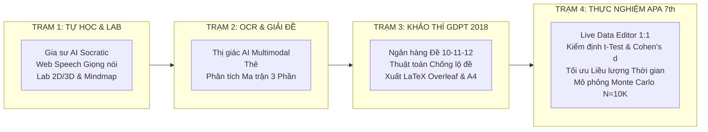

# 🏫 GIA SƯ AI (GSAI) - HỆ SINH THÁI GIÁO DỤC SỐ THPT (KHKT 2026)

> **Dự án Nghiên cứu Khoa học Kỹ thuật (KHKT) Dành Cho Học Sinh Trung Học Năm 2026**  
> *Trường THPT Tân Hiệp & Trung tâm Bồi dưỡng Văn hóa Thiện Nhân (An Giang)*  
> *Đồng hành cùng học sinh khối 10, 11, 12 THPT • Môn Toán học & Hóa học • Chuẩn hóa 100% Bộ sách Kết Nối Tri Thức Với Cuộc Sống (NXB Giáo Dục Việt Nam) & CT GDPT 2018 (QĐ 764/QĐ-BGDĐT, TT 32/2018/TT-BGDĐT & TT 13/2026/TT-BGDĐT)*

---

## 🌐 ĐỊA CHỈ TRUY CẬP VÀ MÃ NGUỒN
- **Web App Trực Tuyến Chính Thức (PWA):** [https://gsaithptth-khkt2026.streamlit.app](https://gsaithptth-khkt2026.streamlit.app)
- **Kho Mã Nguồn GitHub (Public):** [https://github.com/pmtgiaitichk15khkt01-cmd/GSAI_THPTTH2026](https://github.com/pmtgiaitichk15khkt01-cmd/GSAI_THPTTH2026)
- **Cẩm Nang Cài Đặt & Sử Dụng (PDF):** `HUONG_DAN_CAI_DAT_VA_SU_DUNG_GSAI_2026.pdf` *(Xuất bản chuẩn A4)*

---

## 🌟 TRIẾT LÝ GIÁO DỤC, CƠ SỞ PHÁP LÝ & CHUẨN ĐẠO ĐỨC AI

### 1. Triết Lý Sư Phạm Socratic & Polya 4 Bước
- **Không giải bài hộ (Anti-Cheating by Design):** AI đóng vai trò người dẫn dắt sư phạm, tuyệt đối không đưa ra đáp án ăn sẵn. Thay vào đó, AI chia nhỏ vấn đề, đặt câu hỏi gợi mở theo nấc thang nhận thức Bloom và dẫn dắt học sinh tự tìm ra chân lý theo Quy trình 4 bước giải quyết vấn đề của George Polya:
  1. *Hiểu rõ bài toán (Dữ kiện & Mục tiêu)*
  2. *Lập kế hoạch giải (Chọn định lý, công thức)*
  3. *Thực hiện kế hoạch (Tính toán từng bước)*
  4. *Kiểm tra và Nhìn lại (Đánh giá bẫy toán học, bản chất khoa học)*

### 2. Cơ Sở Pháp Lý & Chuẩn Mực Giáo Dục Quốc Gia
- **Chương trình GDPT 2018 (Thông tư 32/2018/TT-BGDĐT):** Toàn bộ ma trận kiến thức, thuật ngữ khoa học và hệ thống câu hỏi bám sát bộ sách giáo khoa *Kết Nối Tri Thức Với Cuộc Sống*.
- **Quyết định số 764/QĐ-BGDĐT:** Cấu trúc khảo thí đề thi THPT Quốc gia chuẩn hóa 3 phần:
  - *Phần I:* Trắc nghiệm nhiều lựa chọn (4 phương án).
  - *Phần II:* Trắc nghiệm Đúng/Sai (4 ý mỗi câu).
  - *Phần III:* Trắc nghiệm trả lời ngắn (Điền số thực tế).
- **Chuẩn Quốc Tế IUPAC:** 100% thuật ngữ và danh pháp Hóa học tuân thủ tiêu chuẩn danh pháp quốc tế IUPAC theo quy định hiện hành của Bộ GD&ĐT.

### 3. Chuẩn Đạo Đức AI & Bảo Vệ Quyền Riêng Tư (UNESCO & Bộ GD&ĐT)
- **Ẩn danh hóa dữ liệu (Anonymization):** Không thu thập thông tin định danh cá nhân nhạy cảm (PII). Học sinh tham gia khảo sát được mã hóa qua mã KPI / ID nội bộ.
- **Bảo mật lưu trữ Client-Side:** Khóa Google Gemini API Key được lưu trữ cục bộ trên trình duyệt của người dùng qua `localStorage`, không truyền về máy chủ trung gian.
- **Minh bạch thuật toán:** Mọi công thức thống kê (Paired $t$-Test, Cohen's $d$, Pearson $r$, Monte Carlo) đều được công khai minh bạch mã nguồn phục vụ hội đồng khoa học thẩm định.

---

## 🚀 KIẾN TRÚC 4 TRẠM CHỨC NĂNG ĐỘC BẢN



### 📖 TRẠM 1: GIA SƯ SOCRATIC & PHÒNG THÍ NGHIỆM ẢO (VIRTUAL LAB)
- **Trợ lý Socratic đa nhân cách:** Gia sư kiên nhẫn, Thầy giáo nghiêm khắc, Bạn học thông thái... dẫn dắt học sinh tự học.
- **Thuyết minh bài học bằng Giọng nói (Web Speech API):** Chuẩn hóa phát âm tiếng Việt các biểu thức Toán phức tạp ($\int, \lim, \vec{u}$) và tên gọi Hóa học IUPAC.
- **Phòng Lab Toán - Hóa 2D/3D (Plotly):** Trực quan hóa hình học không gian $Oxyz$, khối tròn xoay tích phân, đồ thị hàm số và mô hình phân tử.
- **Sơ đồ tư duy D3.js tương tác:** Cây tri thức phân nhánh, hỗ trợ thu phóng, căn giữa và xuất ảnh vector SVG.

### ✍️ TRẠM 2: GIA SƯ AI GIẢI ĐỀ & THỊ GIÁC MÁY TÍNH (MULTIMODAL OCR)
- **Quét nhận diện đề viết tay & in ấn:** Nhận diện công thức toán học LaTeX, đồ thị và sơ đồ thí nghiệm.
- **Cơ chế thẻ phản hồi an toàn `<CONFIRM_ASK>`:** Nếu ảnh chụp bị mờ hoặc công thức không rõ, AI chủ động hỏi lại học sinh để xác nhận, tuyệt đối không đoán mò.
- **Phân tích bẫy câu hỏi:** Chỉ ra các lỗi sai kinh điển và dạng bài tương tự để học sinh khắc sâu kiến thức.

### 📝 TRẠM 3: MA TRẬN & KHẢO THÍ CHUẨN BỘ GD&ĐT
- **Ngân hàng chủ đề GDPT 2018:** Phân cấp chi tiết cho khối 10, 11 và 12.
- **Thuật toán sinh đề đa biến chống lộ đề:** Tự động hoán vị dữ kiện, thay đổi tham số toán học nhưng bảo toàn trọn vẹn bản chất vật lý/hóa học/toán học của bài toán.
- **Xuất bản đề thi chuẩn A4 & LaTeX:** Mã hóa file `.tex` tương thích 100% với Overleaf/TeXLive, sẵn sàng in ấn phát đề kiểm tra.

### 📊 TRẠM 4: THỰC NGHIỆM SƯ PHẠM, KIỂM ĐỊNH APA 7th & BÁO CÁO KHKT
- **Google Sheets Real-Time & Live Data Editor:** Đồng bộ trực tiếp bảng điểm khảo sát từ xa hoặc nhập liệu trực tiếp trên bảng tương tác `st.data_editor`.
- **Bắt cặp 1-1 & So sánh Đối chứng:** So sánh điểm Pre-test (trước can thiệp) và Post-test (sau can thiệp) của từng học sinh; so sánh lớp Thực nghiệm (dùng App) với lớp Đối chứng (học truyền thống).
- **Kiểm định Thống kê Chuẩn APA 7th:**
  - *Paired Samples $t$-Test:* Chứng minh sự tiến bộ có ý nghĩa thống kê vượt trội ($p < 0.001$).
  - *Kích thước tác động Cohen's $d$:* Đo lường hiệu quả can thiệp ở mức rất lớn ($d > 0.8$).
  - *Phổ điểm Gauss dịch chuyển:* Trực quan hóa đường cong phân phối chuẩn dịch sang vùng điểm giỏi.
- **Phân tích Liều lượng Thời gian (Dosage Analysis):** Hồi quy tương quan Pearson ($r$) giữa số phút học và độ tăng điểm $\rightarrow$ Xác lập khuyến nghị khoa học: **Thời gian tự học tối ưu là 25 - 35 phút/ngày**, tránh tình trạng lạm dụng thiết bị.
- **Mô phỏng Mở rộng Toàn tỉnh (Monte Carlo Simulation):** Dự báo phổ điểm và hiệu quả can thiệp khi triển khai diện rộng trên quy mô $N = 10.000$ học sinh.

---

## 📱 HƯỚNG DẪN CÀI ĐẶT WEB APP BIỂU TƯỢNG (PWA)

GSAI là ứng dụng web thế hệ mới (PWA), có thể cài đặt trực tiếp để có **Icon ứng dụng trên màn hình** mà không cần qua App Store hay file APK:

1. **Trên Điện thoại Android (Chrome / Cốc Cốc / Edge):**
   - Mở Chrome $\rightarrow$ Truy cập `https://gsaithptth-khkt2026.streamlit.app`
   - Bấm vào menu **3 dấu chấm (⋮)** ở góc trên bên phải.
   - Chọn **"Thêm vào Màn hình chính"** *(hoặc "Cài đặt ứng dụng")* $\rightarrow$ Bấm **Thêm**.
2. **Trên iPhone / iPad (Apple Safari):**
   - Mở Safari $\rightarrow$ Truy cập liên kết ứng dụng.
   - Bấm nút **Chia sẻ (Share - ô vuông mũi tên hướng lên ↑)**.
   - Chọn **"Thêm vào MH chính" (Add to Home Screen)** $\rightarrow$ Bấm **Thêm (Add)**.
3. **Trên Máy tính PC / Laptop (Chrome / Edge):**
   - Mở liên kết ứng dụng trên Chrome hoặc Edge.
   - Click biểu tượng **Cài đặt ứng dụng (⊕)** trên thanh địa chỉ (URL bar) $\rightarrow$ Chọn **Cài đặt (Install)**.

---

## 🛠️ HƯỚNG DẪN CHẠY LOCAL NỘI BỘ (DÀNH CHO LẬP TRÌNH VIÊN)

```bash
# 1. Clone kho mã nguồn
git clone https://github.com/pmtgiaitichk15khkt01-cmd/GSAI_THPTTH2026.git
cd GSAI_THPTTH2026

# 2. Cài đặt các thư viện cần thiết
pip install -r requirements.txt

# 3. Chạy ứng dụng Streamlit
streamlit run app.py
```

---

## 🔒 THÔNG TIN TÁC GIẢ & BẢN QUYỀN ĐỀ TÀI

- **Đơn vị thực hiện:** Trường THPT Tân Hiệp & Trung tâm Bồi dưỡng Văn hóa Thiện Nhân (An Giang).
- **Mục đích:** Đề tài nghiên cứu ứng dụng AI trong đổi mới phương pháp dạy và học, tham dự Cuộc thi KHKT Quốc gia 2026.
- **Khẩu hiệu hành động:** *Dưỡng thiện tâm - Ươm nhân tài • Khơi dậy tư duy tự học bằng công nghệ AI*.
